# NPKD-TECH Mobile Application

The application will serve as a platform extension for the NPKDTECH robot/system, which is designed for soil sampling and analyzing fertilizer levels by detecting nitrogen, phosphorus, and potassium. The app will display this data in real-time while also providing control features for the system.
## My App 

### Dvelopment Process
In order to develop the app, multiple revisions of the storyboard were made, which allowed me to get creative and understand what I am developing. 
The following picture is of the first storyboard with pen and paper. 

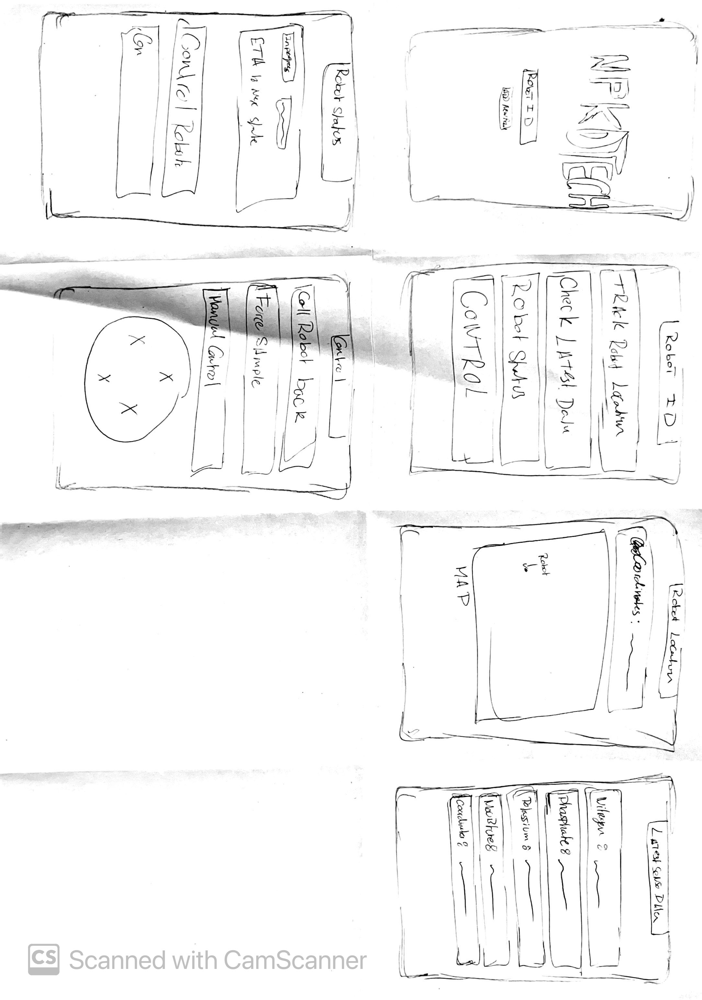

For more detail, I developed an additional round of storyboards that delve deeper into the user experience, bringing the application to life and making it more interactive. This process was invaluable during development, as it provided a clear vision of the goals I aimed to achieve.

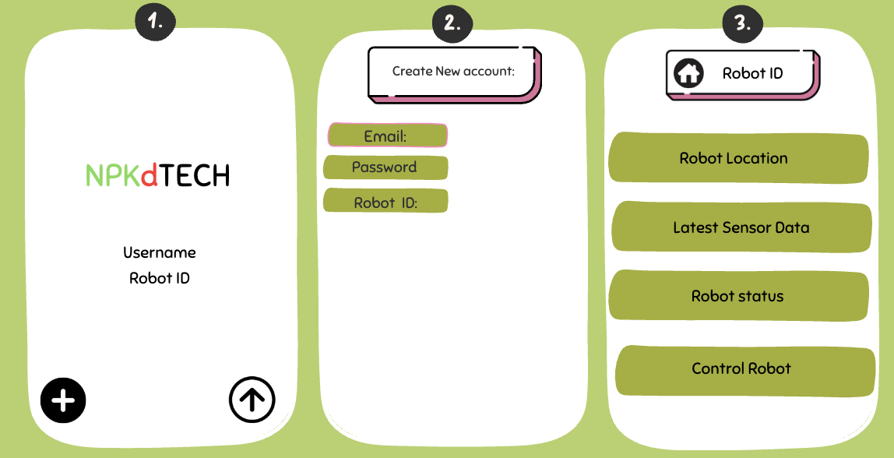
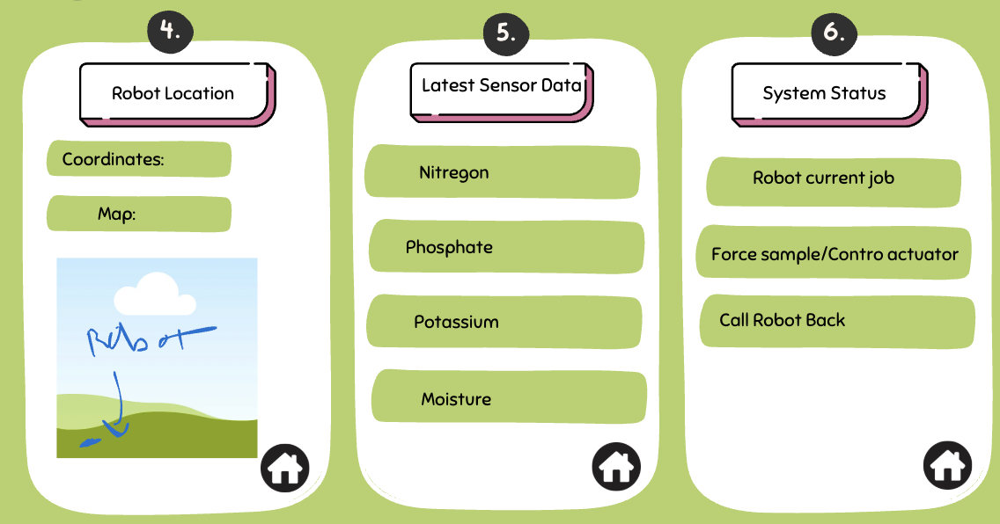

After development, this is how the app looked with all the different interfaces and pages. Inspired by the initial storyboard. Making a simple inetface which is easy to use and proviodes the user with the data which they need straighaway without alot of clunk, which was the goal from the begining. 

  <!-- Top row: 4 images -->
  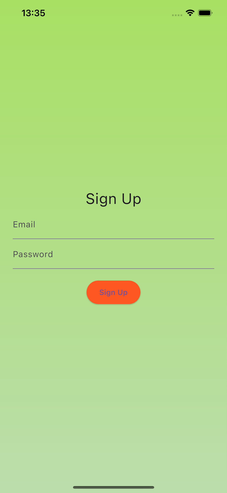
  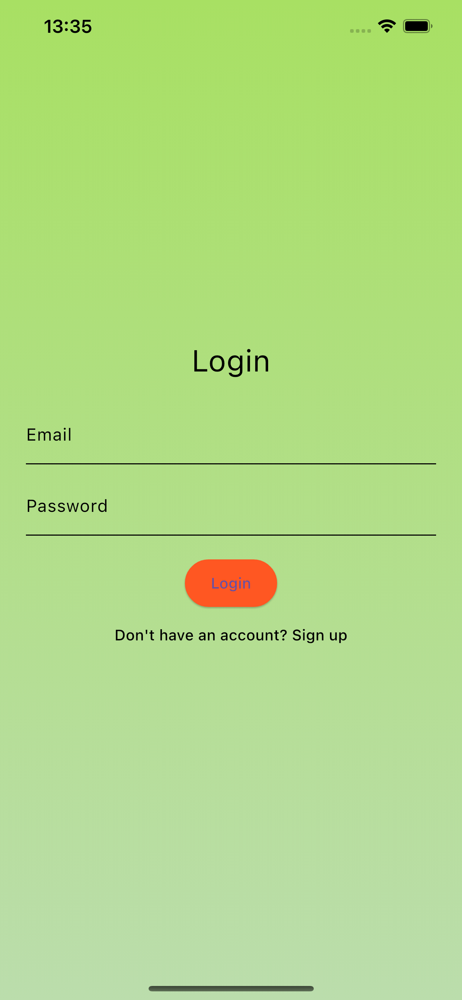
  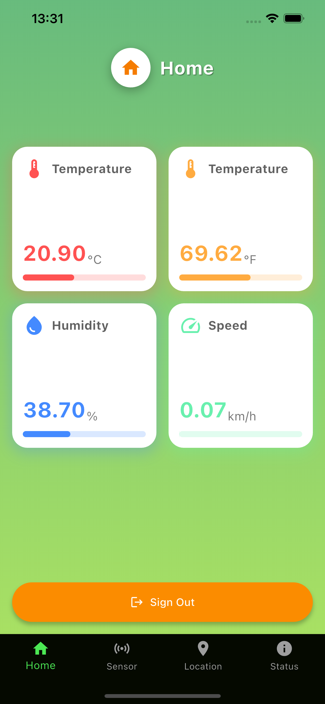
  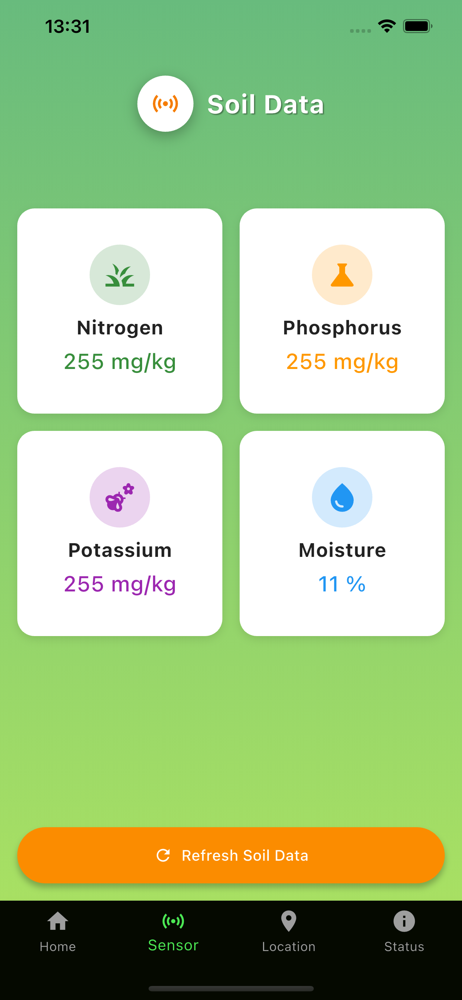

  <!-- Bottom row: 3 images -->
  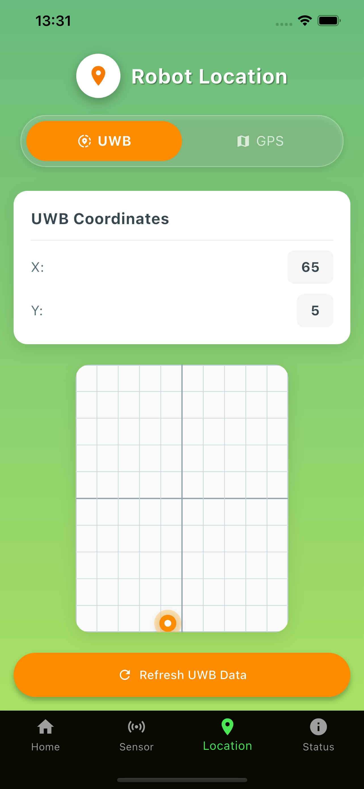
  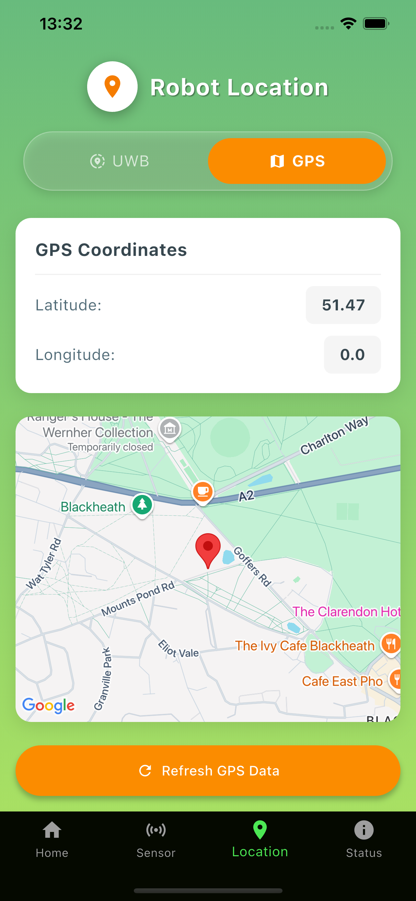
  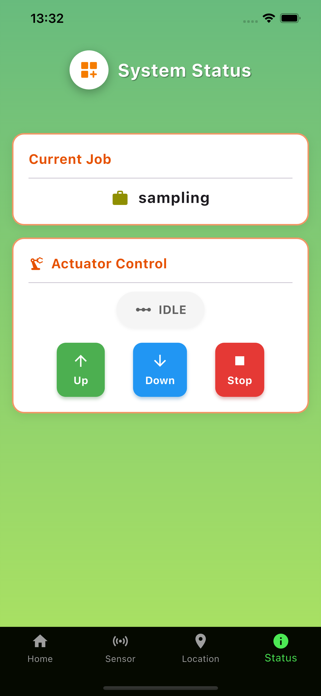

### Features

- **Authentication & Privacy** 🔐  
  User authentication and data privacy are handled securely using **Firebase Authentication**. This ensures that each user’s data is protected, providing a personalized and safe experience for every individual.

- **Real-Time Data Viewing** 📊  
  The application connects to **Firebase Realtime Database** to provide live updates on the system's data. This enables seamless tracking and monitoring of the soil sampling process, allowing users to view real-time information without delays.

- **Location Tracking with Google Maps & UWB** 📍  
  Users can view the robot's location on **Google Maps**, while **Ultra-Wideband (UWB)** technology is used to enhance accuracy for close-distance location tracking. This ensures precise navigation and real-time updates for the robot’s position, especially in confined spaces.

- **Robot Actuator Control** 🤖  
  The app provides users with the ability to remotely control the robot’s actuator, allowing for precise movement and operation during the soil sampling process. This feature ensures that users can guide the robot effectively to the desired location, enhancing the flexibility and functionality of the system.

### Tools

- **Firebase Authentication & Realtime Database** 🔐  
  Firebase is used for user authentication and real-time data synchronization.

- **Google Maps API** 🌍  
  The Google Maps API is utilized for location tracking.

- **ESP32 Nano** 💻  
  The **ESP32 Nano** is the microcontroller that powers the robot and handles all the communication, data processing, and control operation.

- **NPK, Temperature, and Humidity Sensors** 🌱🌡️💧  
  These sensors are responsible for collecting soil data, as well as environmental factors such as temperature and humidity. This data is essential for analyzing soil health and fertilizer needs.

- **GPS Module & UWB Probes** 🛰️  
  The **GPS module** provides location tracking, while the UWB is more for accuracy and precision.

- **Linear Actuator** ⚙️  
  The **linear actuator** is used to control the sensors up and down
### The Database
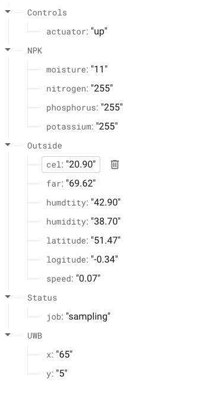

### Sensor system 

  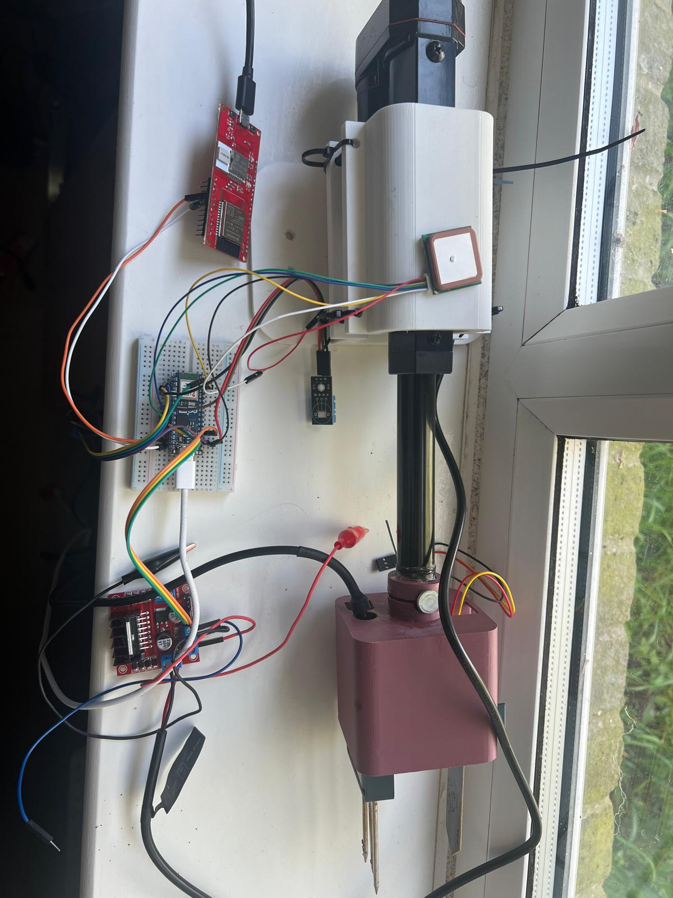
  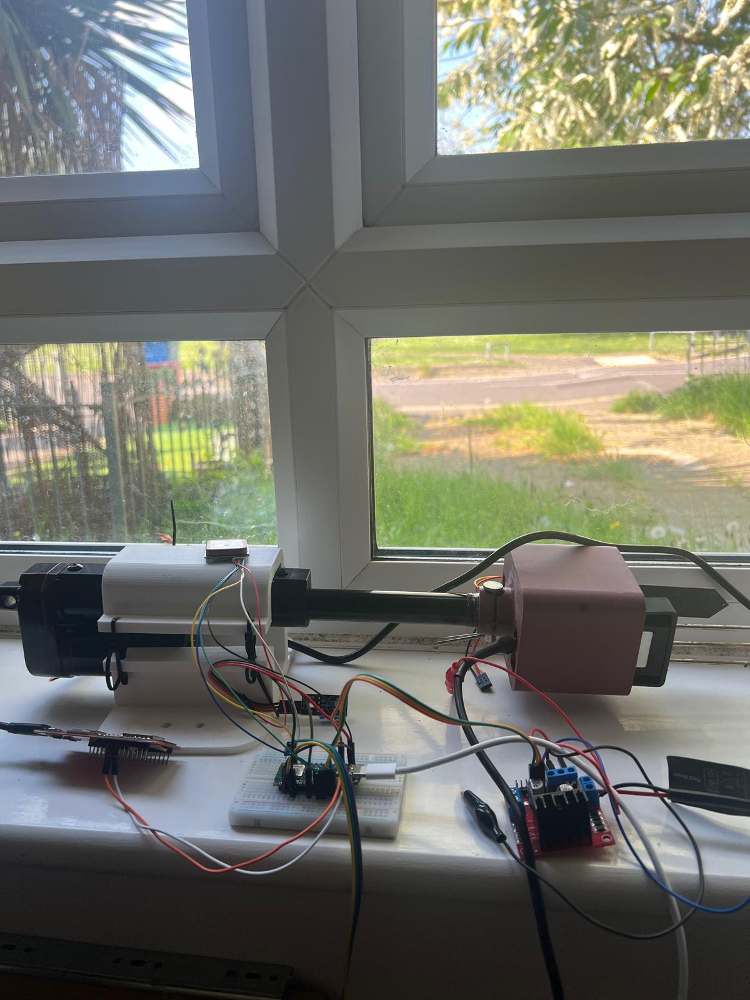

## Include A Section That Tells Developers How To Install The App

##  Contact Details

Having Contact Details is also good as it shows people how to get in contact with you if they'd like to contribute to the app. 
